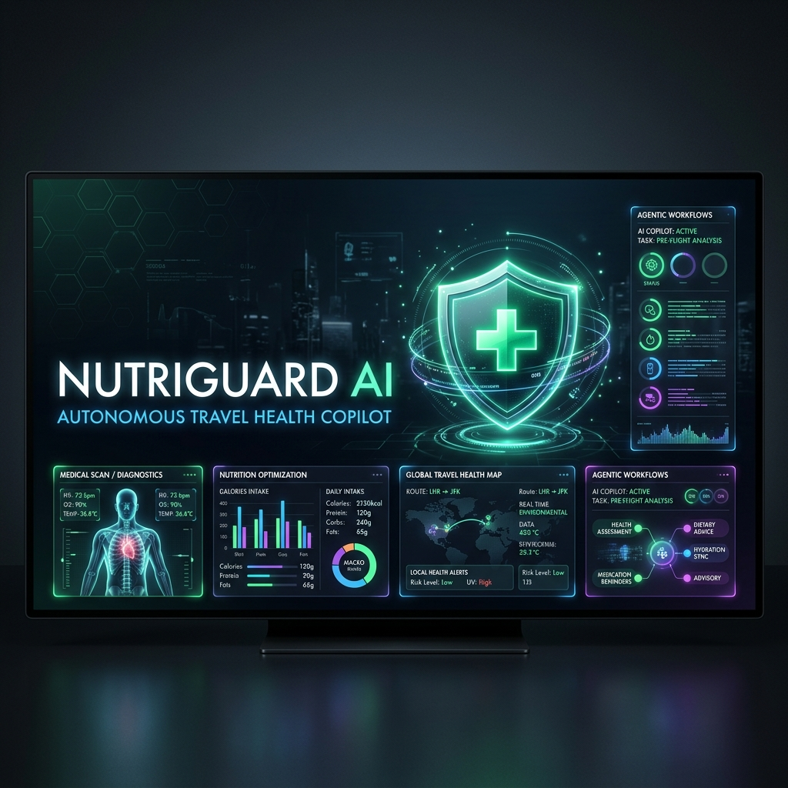
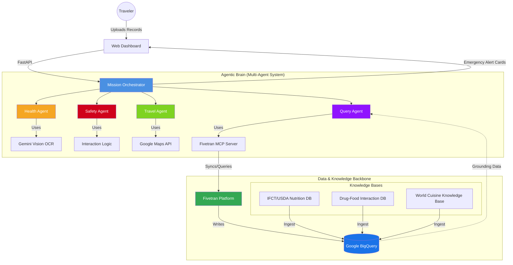

# 🛡️ NutriGuard AI — Autonomous Travel Health Copilot

> **Google Cloud Rapid Agent Hackathon 2026** | **Fivetran Partner Track Submission**

[](https://python.org)
[](https://ai.google.dev)
[](https://fivetran.com)
[](LICENSE)



NutriGuard AI is an autonomous multi-agent copilot that transforms static medical records into real-time, context-aware travel health intelligence. By bridging the gap between personal clinical history and global destination data, NutriGuard executes "health missions" to ensure traveler safety.

---

## 🌍 The Problem
Travelers with chronic conditions, severe allergies, or active medication regimes face a "fragmented safety" reality. Existing apps provide generic advice but fail to synthesize **Medical Profiles**, **Culinary Chemistry**, and **Local Infrastructure** in real-time. NutriGuard bridges this gap, ensuring that a peanut allergy in Tokyo or a drug-food interaction in Delhi becomes a managed, low-risk event.

## 🚀 The Solution: Agentic Mission Control
NutriGuard moves beyond simple Q&A. It deploys a **Mission Orchestrator** that coordinates specialized agents to execute end-to-end safety workflows:

* **Clinical Agent:** Uses Gemini 2.5 Vision to perform high-fidelity OCR on lab reports and prescriptions, structuring them into a JSON health profile.
* **Safety Agent:** Cross-references the health profile against drug-food interaction databases and the USDA/IFCT nutritional datasets.
* **Operational Agent (Fivetran-Powered):** Connects our AI to live agricultural and health data via BigQuery, ensuring our intelligence is never based on stale information.

---

## 🏗️ Architecture



---

## 🛠️ Tech Stack

* **AI Orchestration:** Google Cloud Agent Builder, Gemini 2.5 Flash, Gemini Vision.
* **Data Integration:** Fivetran MCP Server, BigQuery (ELT Pipeline).
* **Intelligence Layer:** IFCT/USDA/Drug-Food Interaction Knowledge Bases.
* **Mapping/Geo:** Google Maps API (Hospitals/Pharmacies).
* **Backend:** FastAPI (Python) & Streamlit.

---

## 🗝️ Fivetran Partner Integration

We treat Fivetran as an active **Operational Agent**. Rather than manual data updates, our Query Agent uses the Fivetran MCP Server to:

1. **Autonomously Verify:** Check pipeline sync status before answering queries.
2. **Grounding:** Perform SQL-based lookups against BigQuery to ensure nutritional advice is calibrated to the latest regional food market data.
3. **Resilience:** Provide a scalable ELT foundation for live agricultural data ingestion (Agmarknet).

---

## ✨ Key Features

### 1. Medication ↔ Destination Cuisine Risk Engine (Unique Feature)
Detects clinically dangerous drug-food combinations specific to the destination cuisine:

| Medication | Destination | Risk | Specific Dishes to Avoid |
|-----------|------------|------|--------------------------|
| Warfarin  | Japan       | 🔴 Critical | Natto, Seaweed Salad, Edamame |
| Atorvastatin | Thailand | 🔴 High | Pomelo Salad, Som Tum |
| Metformin | Japan | 🟠 High | Sake, Sake-broth dishes |
| MAO Inhibitors | Korea | 🔴 Critical | Kimchi, Doenjang Jjigae |

### 2. Gemini Vision OCR
Paste or upload medical reports (PDF/image) → Gemini extracts conditions, allergies, medications with structured JSON output.

### 3. Fivetran Data Pipeline
Real-time food commodity price intelligence via Agmarknet → Fivetran → BigQuery, making NutriGuard agents data-warehouse-aware.

### 4. QueryAgent with Gemini Intent Routing
Ask anything in natural language:
- *"Can I eat sushi in Tokyo?"*
- *"What is the price of Bajra today?"*
- *"Where is the nearest hospital in Bangkok?"*

---

## 🏆 Submission Tracks

* **Fivetran Track:** Leveraged Fivetran MCP for real-time, warehouse-grounded AI decision-making.
* **Agent Platform Track:** Built on a modular multi-agent architecture using Gemini 2.5 and Vertex AI.

---

## ⚙️ Setup & Deployment

### 1. Local Development

For testing agentic workflows and OCR logic on your local machine:

```bash
# Clone the repository
git clone https://github.com/PranavS1604/NutriGuard-AI
cd nutriguard-ai

# Install Python dependencies
pip install -r requirements.txt

# Configure your environment
# Create a .env file and add your keys (GEMINI, SAMBANOVA, FIVETRAN, etc.)
cp .env.example .env

# Run the FastAPI application
uvicorn app.api.main:app --reload

# Verify Agentic Logic & OCR
python test_agents_and_ocr.py
```

### 2. Production Deployment (Docker)

The project is containerized for consistent deployment across any cloud provider.

```bash
# Build the Docker image
docker build -t nutriguard-ai .

# Run the container locally
docker run -p 8080:8080 \
  -e GEMINI_API_KEY=your_key \
  -e FIVETRAN_API_KEY=your_key \
  nutriguard-ai
```

### 3. Live Demo

The project is currently hosted and accessible for evaluation:

👉 **[NutriGuard AI Live Dashboard](https://nutriguard-ai.onrender.com/)**

*Note: Ensure the `/api/health` endpoint returns `{"status":"healthy", ...}` to verify the service is ready for agentic missions.*

---

## 📊 Data Sources

| Source | Type | Usage |
|--------|------|-------|
| IFCT 2017 | Local CSV | Indian food nutrition |
| USDA Foundation Foods | Local CSV | Global food nutrition |
| DrugBank 6.0 | Local JSON | 10,000+ drug interactions |
| World Cuisine KB | Local CSV | 179 dishes from 25+ cuisines |
| Agmarknet API | Live → Fivetran | Agricultural commodity prices |
| Google Maps API | Live | Hospital/pharmacy geolocation |
| Gemini 2.5 Flash | API | OCR, translation, NLP |

---

## 📄 License

MIT License — see [LICENSE](LICENSE)

---

*Built with ❤️ for the 2026 Google Cloud Rapid Agent Hackathon.*
